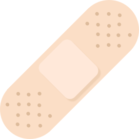
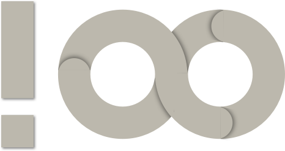

<a href="https://gitter.im/uptech/Constraid?utm_source=badge&utm_medium=badge&utm_campaign=pr-badge&utm_content=badge">
  
</a>

<a href="https://github.com/Carthage/Carthage">
  
</a>

<a href="https://travis-ci.org/uptech/Constraid">
  
</a>

# Constraid

Constraid is your personal `NSLayoutConsraint` Aid. It's job is to make it as simple as
possible for you to programmatically use AutoLayout in your iOS & macOS projects.

For example if you have a child view (`childView`) added as a subview of a parent
view (`parentView`) and you want that child view to match the width of the
parent view and be flush with the top edge of the parent view  you would
normally do the following with AutoLayout:

```swift
childView.translatesAutoresizingMaskIntoConstraints = false
childView.leadingAnchor.constraint(equalTo: parentView.leadingAnchor).isActive = true
childView.trailingAnchor.constraint(equalTo: parentView.trailingAnchor).isActive = true
childView.topAnchor.constraint(equalTo: parentView.topAnchor).isActive = true
```

However, with the aid of [Constraid][constraid] it is as simple as

```swift
cup(childView, byTopEdgeOf: parentView).activate()
```

The power of [Constraid][constraid] is that it provides higher level concepts
such as `cup`, `flush`, etc.  that make it easier to reason about your layouts,
and does so in a way fully discoverable via auto-completion and focused on
reducing the amount of code necessary to properly define layouts.

Another powerful concept it introduces is constraint collections which can be
combined as follows:

```swift
let constraints = flush(childView, withVerticalEdgesOf: parentView) +
                  center(childView, verticallyWithin: parentView)
constraints.activate()
```

Since it is common to apply multiple constraints to a view.
[Constraid][constraid] uses a proxy pattern allowing you to implement the above
in a much more concise syntax.

```swift
let proxy = childView.constraid
              .flush(withVerticalEdgesOf: parentView)
              .center(verticallyWithin: parentView)
proxy.activate()
```

The above is extremely useful when doing AutoLayout Animation or when you
simply want to deactivate or activate a collection of constraints.

However, if you don't need to reference the proxy to the collection of constraints for later to use for animation, etc. you can simply activate at the end of the chain.

```swift
childView.constraid
  .flush(withVerticalEdgesOf: parentView)
  .center(verticallyWithin: parentView)
  .activate()
```


## Setup

[Swift Package Manager](https://swift.org/package-manager/) is the best way to add [Constraid][constraid] to your project.

However, we also support [Carthage][carthage] as well. To use [Carthage][carthage] simply do the following:

1. Add the following to your [Cartfile][cartfile].

    ```
    github "uptech/Constraid"
    ```

2. Follow the [Carthage][cartfile] instructions for adding frameworks to your application.


## Usage

[Constraid][constraid] tries to simplify things by building on top of the lower level
constructs provided by Apple's AutoLayout system.

In general [Constraid][constraid] provides a number of methods that aid with
defining constraint relationships between views. Currently, the provided methods are grouped
into the following sections.

### Flush

Lets say you want `viewA` to sit flush or right along `viewB`'s edges, meaning be
sized the same size as `viewB`. You can accomplish this by using the following:

```swift
flush(viewA, withEdgesOf: viewB)
```

If on the other hand you wanted `viewA` to fill the space of `viewB` up to `viewB`'s
margins, you could simply do.

```swift
flush(viewA, withMarginsOf: viewB)
```

The `flush` methods simply create one or more equivalency constraints between the two views
and the appropriate attributes. A list of the short versions of all the `flush`
methods are provided below.

```swift
flush(viewA, withLeadingEdgeOf: viewB)
flush(viewA, withTrailingEdgeOf: viewB)
flush(viewA, withTopEdgeOf: viewB)
flush(viewA, withBottomEdgeOf: viewB)

flush(viewA, withVerticalEdgesOf: viewB)
flush(viewA, withHorizontalEdgesOf: viewB)

flush(viewA, withEdgesOf: viewB)

flush(viewA, withLeadingMarginOf: viewB)
flush(viewA, withTrailingMarginOf: viewB)
flush(viewA, withTopMarginOf: viewB)
flush(viewA, withBottomMarginOf: viewB)

flush(viewA, withVerticalMarginsOf: viewB)
flush(viewA, withHorizontalMarginsOf: viewB)

flush(viewA, withMarginsOf: viewB)
```


### Center

Ok so you want `viewA` to be centered inside of `viewB`'s edges. You can accomplish this by
using the following:

```swift
center(viewA, within: viewB)
```

If on the other hand you wanted `viewA` to be centred inside of `viewB`s margins you could
simply do.

```swift
center(viewA, withinMarginsOf: viewB)
```

The `center` methods simply create one or more equivalency constraints between the two views
and the appropriate attributes (`centerX`, `centerY`, `centerXwithinMargins`,
`centerYwithinMargins`). A list of the short versions of all the `center`
methods are provided below.

```swift
center(viewA, verticallyWithin: viewB)
center(viewA, horizontallyWithin: viewB)

center(viewA, within: viewB)

center(viewA, verticallyWithinMarginsOf: viewB)
center(viewA, horizontallyWithinMarginsOf: viewB)

center(viewA, withinMarginsOf: viewB)
```

### Cup

Lets say you want `viewA` to sit flush or right along `viewB`'s leading, top,
and trailing edges. You can accomplish this by using the following:

```swift
cup(viewA, byTopEdgeOf: viewB)
```

If on the other hand you wanted `viewA` to sit flush or right along `viewB` up to `viewB`'s
leading, top, and trailing margins, you could simply do.

```swift
cup(viewA, byTopMarginOf: viewB)
```

The `cup` methods simply create three equivalency constraints between the two
views and the appropriate attributes to cup the `viewA` along 3 edges. A list
of the short versions of all the `cup` methods are provided below.

```swift
cup(viewA, byTopEdgeOf: viewB)
cup(viewA, byBottomEdgeOf: viewB)
cup(viewA, byLeadingEdgeOf: viewB)
cup(viewA, byTrailingEdgeOf: viewB)

cup(viewA, byTopMarginOf: viewB)
cup(viewA, byBottomMarginOf: viewB)
cup(viewA, byLeadingMarginOf: viewB)
cup(viewA, byTrailingMarginOf: viewB)
```

### Manage Size

Lets say you want `viewA`'s width to be explicitly sized to some 100 pts. You can accomplish
this by using the following:

```swift
setWidth(of: viewA, to: 100)
```



If on the other hand you wanted `viewA`'s height to be explicitly sized to 100 pts you would
do.

```swift
setHeight(of: viewA, to: 100)
```

The `setWidth` and `setHeght` methods simply create one or more equivalency constraints
between the view and the appropriate attributes. A list of the short versions
of all the `setWidth` and `setHeight` methods are provided below.

```swift
setWidth(of: item, to: constant)
setHeight(of: item, to: constant)
```

If you want to expand from a minimum width you can do so using the following:

```swift
expandWidth(of: item, from: constant)
expandHeight(of: item, from: constant)
limitWidth(of: item, by: constant)
limitHeight(of: item, by: constant)
```

Similarly, if you want to make the width of one view equal to another view's width you can do this:

```swift
matchWidth(of: viewA, to: viewB)
```

And for the height:

```swift
matchHeight(of: viewA, to: viewB)
```

When you want to make a view's height and width equal you can do:

```swift
equalize(viewA)
```

When you want to make a view have a specific aspect ratio you can do:

```swift
let size = CGSize(width: 3, height: 5)
setAspectRatio(of: viewA, toSize: size)
```

### Manage Relative Position

Lets say you want `viewA` to be position right after `viewB`'s edge. You can accomplish this
by using the following:

```swift
follow(theTrailingEdgeOf: viewB, with: viewA)
```

Or lets say you want `viewA` to be positioned in front of `viewB`'s edge. You could do the
following.

```swift
precede(theLeadingEdgeOf: viewB, with: viewA)
```

If on the other hand you want to control the vertical position you can use `set`.

These methods simply create one or more equivalency constraints between the two views and the
appropriate attributes. A list of the short versions of all these methods are provided
below.

```swift
follow(theTrailingEdgeOf:with:)
follow(theTrailingMarginOf:with:)
follow(theCentorOf:with:)

precede(theLeadingEdgeOf:with:)
precede(theLeadingMarginOf:with:)
precede(theCenterOf:with:)

set(viewA, aboveTheTopEdgeOf:)
set(viewA, aboveTheTopMarginOf:)
set(viewA, aboveTheCenterOf:)
set(viewA, belowTheBottomEdgeOf:)
set(viewA, belowTheBottomMarginOf:)
set(viewA, belowTheCenterOf:)
```



### Limit

Lets say you want `viewA` to be limited by `viewB`'s edges. You can accomplish this by using
the following:

```swift
limit(viewA, byEdgesOf: viewB)
```

This sets up constraints saying that each of `viewA`'s edges must be `<=` `viewB`'s
respective edges.

If on the other hand you wanted `viewA` limited by `viewB`s margins you could
simply do.

```swift
limit(viewA, byMarginsOf: viewB)
```

The `limit` methods simply create one or more `<=` constraints between the two views and the
appropriate attributes. A list of the short versions of all the `limit` methods are provided
below.

```swift
limit(viewA, byLeadingEdgeOf: viewB)
limit(viewA, byTrailingEdgeOf: viewB)
limit(viewA, byTopEdgeOf: viewB)
limit(viewA, byBottomEdgeOf: viewB)

limit(viewA, byVerticalEdgesOf: viewB)
limit(viewA, byHorizontalEdgesOf: viewB)

limit(viewA, byEdgesOf: viewB)

limit(viewA, byLeadingMarginOf: viewB)
limit(viewA, byTrailingMarginOf: viewB)
limit(viewA, byTopMarginOf: viewB)
limit(viewA, byBottomMarginOf: viewB)

limit(viewA, byVerticalMarginsOf: viewB)
limit(viewA, byHorizontalMarginsOf: viewB)

limit(viewA, byMarginsOf: viewB)
```

### Expand

Lets say you want `viewA` to be expanded from `viewB`'s edges out. You can accomplish this
by using the following:

```swift
expand(viewA, fromEdgesOf: viewB)
```

This sets up constraints saying that each of `viewA`'s edges must be `>=` `viewB`'s
respective edges.

If on the other hand you wanted `viewA` to be expanded from `viewB`s margins you could
simply do.

```swift
expand(viewA, fromMarginsOf: viewB)
```

The `expand` methods simply create one or more `>=` constraints between the two views and
the appropriate attributes. A list of the short versions of all the `expand` methods are
provided below.

```swift
expand(viewA, fromLeadingEdgeOf: viewB)
expand(viewA, fromTrailingEdgeOf: viewB)
expand(viewA, fromTopEdgeOf: viewB)
expand(viewA, fromBottomEdgeOf: viewB)

expand(viewA, fromVerticalEdgesOf: viewB)
expand(viewA, fromHorizontalEdgesOf: viewB)

expand(viewA, fromEdgesOf: viewB)

expand(viewA, fromLeadingMarginOf: viewB)
expand(viewA, fromTrailingMarginOf: viewB)
expand(viewA, fromTopMarginOf: viewB)
expand(viewA, fromBottomMarginOf: viewB)

expand(viewA, fromVerticalMarginsOf: viewB)
expand(viewA, fromHorizontalMarginsOf: viewB)

expand(viewA, fromMarginsOf: viewB)

expand(viewA, fromWidthOf: viewB)
expand(viewA, fromHeightOf: viewB)
```

### Manage Intrinsic Size Relations

These allow you to define the content hugging and compression resistance priorities and
constraints for a given view. *Note:* The priorities are linked so that they will be the
same. If you want to set them independently you should use the native API provided by Apple
for this.

```swift
keepIntrinsicHeight(of: viewA, priority:)
keepIntrinsicWidth(of: viewA, priority:)

keepIntrinsicSize(of: viewA, priority:)
```

## Build

We supports [Carthage][carthage] and therefore this project can be built using the following.

```
carthage build --no-skip-current
```

However, if you don't want to use [Carthage][carthage] or you are having difficulties with
build failures you can try the following which should provide some more details.

```
xcodebuild -scheme Constraid-MacOS -project Constraid.xcodeproj build
xcodebuild -scheme Constraid-iOS -project Constraid.xcodeproj build
```

## License

`Constraid` is Copyright © 2017-2019 UpTech Works, LLC. It is free software, and
may be redistributed under the terms specified in the LICENSE file.

## Our Mascots

The mascots for our project are the work of [Ron Leishman][]. We licensed them and they are
available for licensing if you like from [shutterstock][crazyman].

## About

`Constraid` is maintained and funded by [Uptech Studio][uptech], a
software product, design & development consultancy.

We love open source software. See [our other projects][community] or
[hire us][hire] to design, develop, and grow your product.

[community]: https://github.com/uptech
[hire]: http://upte.ch
[uptech]: http://upte.ch
[carthage]: https://github.com/Carthage/Carthage
[constraid]: https://github.com/uptech/Constraid
[crazyman]: https://www.shutterstock.com/image-vector/crazy-cartoon-man-straight-jacket-193143881
[Ron Leishman]: https://www.shutterstock.com/g/Ron+Leishman
[travisproject]: https://travis-ci.org/uptech/Constraid
[gitterroom]: https://gitter.im/uptech/Constraid?utm_source=badge&utm_medium=badge&utm_campaign=pr-badge&utm_content=badge
[cartfile]: https://github.com/Carthage/Carthage#adding-frameworks-to-an-application
